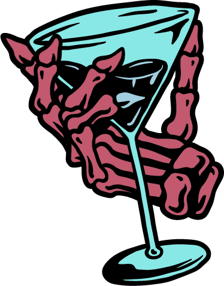
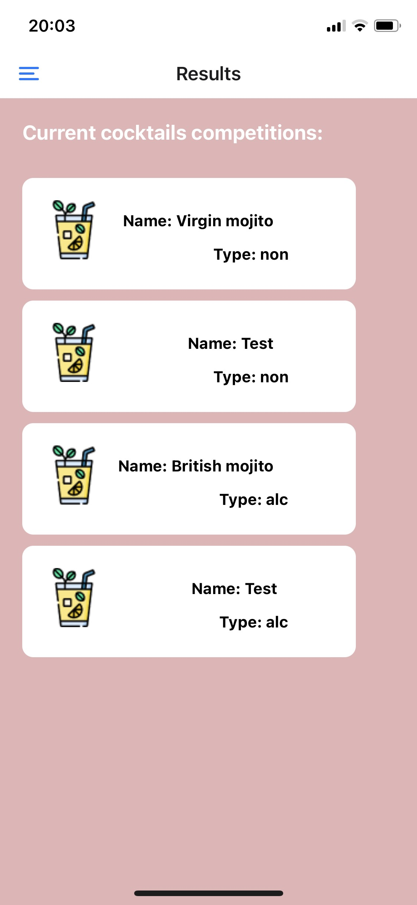
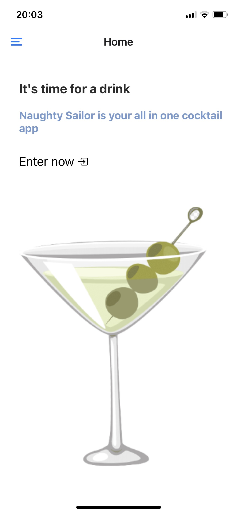
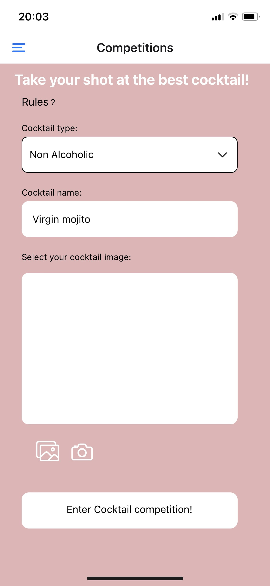
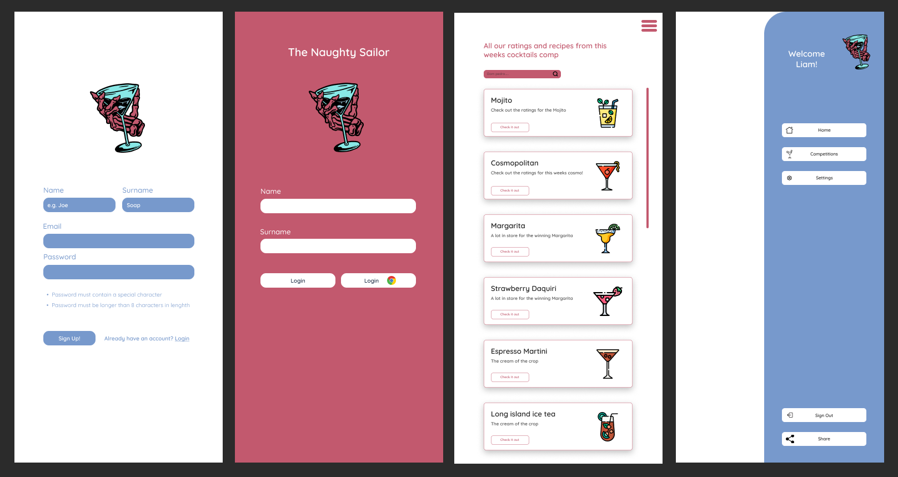
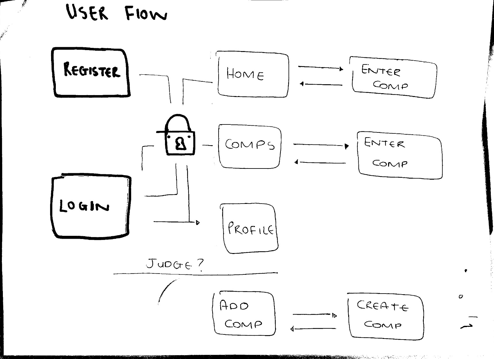
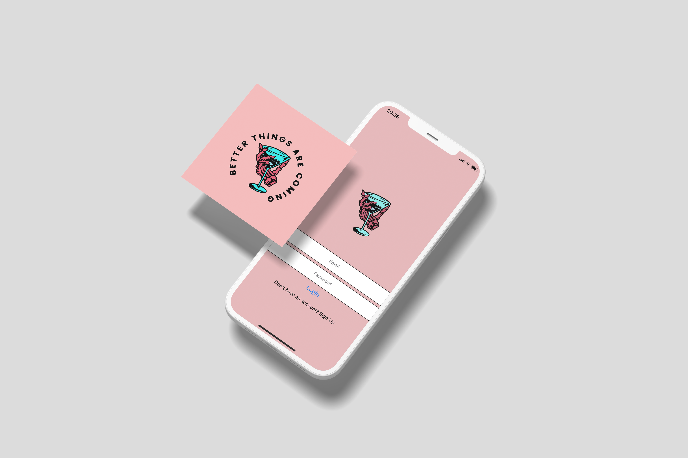

<!-- Repository Information & Links-->
<br />


<!-- HEADER SECTION -->
<h5 align="center" style="padding:0;margin:0;">Liam Wedge</h5>
<h5 align="center" style="padding:0;margin:0;">21100218</h5>
<h6 align="center">DV300 - Term 2 Project | 2023</h6>
</br>
<p align="center">

  <a href="https://github.com/NoSleepTillLambos/TheNaughtySailor">
    
  </a>
  
  <h3 align="center">The Naughty Sailor</h3>

  <p align="center">
    This project was developed using React-native, Firebase and React Native elements <br>
    
    
   <br />
   <br />
   <a href="https://drive.google.com/drive/folders/1bHFGq7nIGPdDqJGrCNNCiSqTUyPk-h7F">View Demo</a>
    ·
    <a href="https://github.com/NoSleepTillLambos/TheNaughtySailor">Report Bug</a>
    ·
    
</p>
<!-- TABLE OF CONTENTS -->

## Table of Contents

- The project is centred around the world of Block babies, a fictional world I have developed based on the game <br/>
  <a href="https://axieinfinity.com/">Axie infinity</a>
- [Getting Started](#getting-started)
  - [Prerequisites](#prerequisites)
  - [How to install](#how-to-install)
- [Features and Functionality](#features-and-functionality)
- [Concept Process](#concept-process)
  - [Ideation](#ideation)
  - [WireFrames](#wireframes)
  - [Custom UI](#user-flow)
- [Development Process](#development-process)
  - [Implementation Process](#implementation-process)
  - [Future Implementation](#peer-reviews)
- [Final Outcome](#final-outcome)
  - [Mockups](#mockups)
  - [Video Demonstration](#video-demonstration)
- [Conclusion](#conclusion)
- [License](#license)
- [Contact](liamwedge00@gmail.com)
- [Acknowledgements](#acknowledgements)

<!-- header image of project -->


### Project Description

Naughty sailor is based off one of my favourite cocktails, it allows users to vote on certain drinks and enter into competitions themselves to prove who the best cocktail maker around
is!

### Built With

- [Firebase](https://console.firebase.google.com/)
- [React Native](https://reactnative.dev/)
- [Expo](https://expo.dev/)

<!-- GETTING STARTED -->

## Getting Started

The following instructions will get you a copy of the project up and running on your local machine for development and testing purposes.

### Prerequisites

Ensure that you have the latest version of [NPM](https://www.npmjs.com/) installed on your machine. The [GitHub Desktop](https://desktop.github.com/) program will also be required.

### How to install

### Installation

Here are a couple of ways to clone this repo:

1.  GitHub Desktop </br>
    Enter `https://github.com/NoSleepTillLambos/TheNaughtySailor` into the URL field and press the `Clone` button.

2.  Clone Repository </br>
    Run the following in the command-line to clone the project:

    ```sh
    git clone https://github.com/NoSleepTillLambos/TheNaughtySailor
    ```

        Open `Software` and select `File | Open...` from the menu. Select cloned directory and press `Open` button

3.  Install Dependencies </br>
    Run the following in the command-line to install all the required dependencies:

    ```sh
    npm install
    ```

4.  An API key is not required for this installation

<!-- FEATURES AND FUNCTIONALITY-->
<!-- You can add the links to all of your imagery at the bottom of the file as references -->

## Features and Functionality

<!-- note how you can use your gitHub link. Just make a path to your assets folder -->



- Users can select a pre existing competition where they can go on to vote and comment on other entries

### Feature 2



- Home page, users are introduced to the app and can then move to the create entry screen where they can enter into a cocktail comp and compete

### Feature 3



- Users can create a cocktail entry by uploading the details and an image of their creation, along with some details about the ingredients and other important information so users can try the recipes at home for themselves!
- Users being able to try the cocktails out is the entire premise of the app, teaching keen learners a new hobbie!

<!-- CONCEPT PROCESS -->
<!-- Briefly explain your concept ideation process -->
<!-- here you will add things like wireframing, data structure planning, anything that shows your process. You need to include images-->

## Concept Process

The concept originated from my job. I work as a bartender at a high end establishment and always felt the need for customers to have the ability to visit the shop,
have a cocktail and then rate it on an app of some sort, thus my idea was born!

### Road Map and conceptual process



<!-- DEVELOPMENT PROCESS -->

## Development Process

- I spent a lot of time on apps that were in line with what i was trying to create, i.e restaurants, bars etc and went through the functionality and how the app flowed

- There is still a lot of work to do however but being that it's something i am passionate about im excited for the future of it

### Implementation Process

<!-- stipulate all of the functionality you included in the project -->
<!-- This is your time to shine, explain the technical nuances of your project, how did you achieve the final outcome!-->

- A big part of the process was getting familiar with Expo and the world of mobile development and getting familiar with working on android and ios.

#### Above And Beyond

Going above and beyond the brief

<!-- what did you learn outside of the classroom and implement into your project-->

- Search functionality
- Google login and verification (todo)

### Future Implementation

<!-- stipulate functionality and improvements that can be implemented in the future. -->

- In future i would like to publish the app to the app store, Firebase could be an issue however with calls to the db. I'd really like to create something real world ready.
- Functionality to login with a Google account
- Google reviews
- Posting comments to the db

<!-- MOCKUPS -->

## Final Outcome

### Mockups


<br>


<!-- VIDEO DEMONSTRATION -->

### Video Demonstration

To see a run through of the application, please click below:

[View Demonstration](https://drive.google.com/drive/folders/1IiMC4ZpDRhs8Q5RuAk9rlZmzaHfeihNa)

See the [open issues](https://github.com/NoSleepTillLambos/TheNaughtySailor) for a list of proposed features (and known issues).

<!-- AUTHORS -->

## Authors

[LiamWedge](https://github.com/NoSleepTillLambos)

<!-- LICENSE -->

## License

Distributed under the MIT License. See `LICENSE` for more information.\

<!-- LICENSE -->

## Contact

- **Liam Wedge** - [liamwedge00@gmail.com]()
- **Naughty Sailor** - https://github.com/NoSleepTillLambos/TheNaughtySailor

<!-- ACKNOWLEDGEMENTS -->

## Acknowledgements

<!-- all resources that you used and Acknowledgements here -->

- [Firebase](https://console.firebase.google.com/)
- [React Native](https://reactnative.dev/)
- [Expo](https://expo.dev/)
