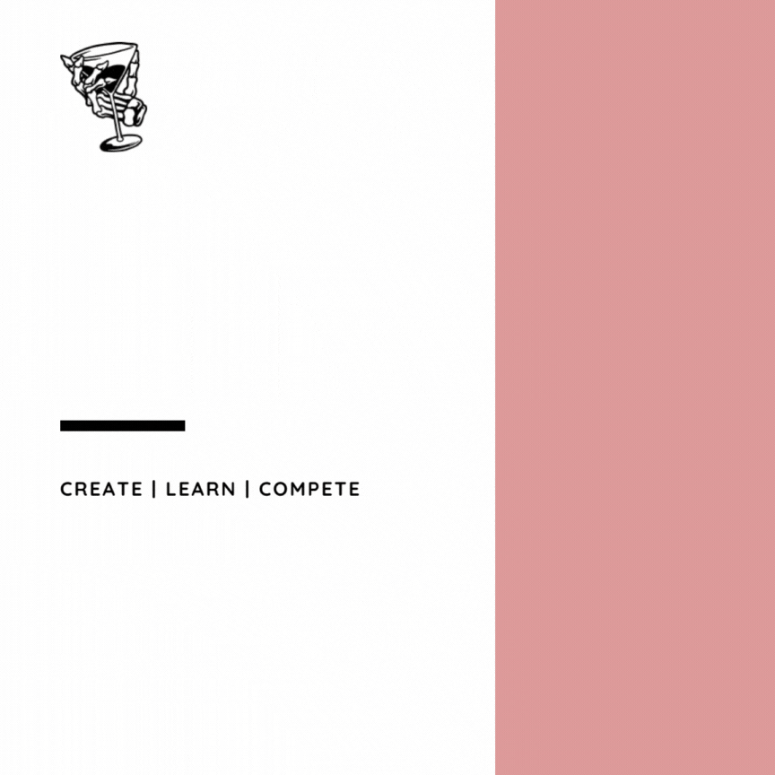
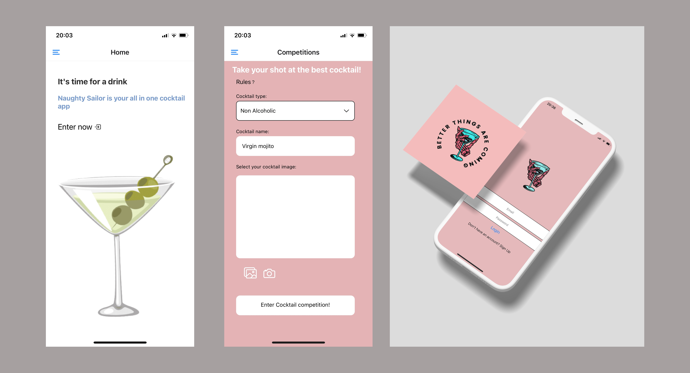
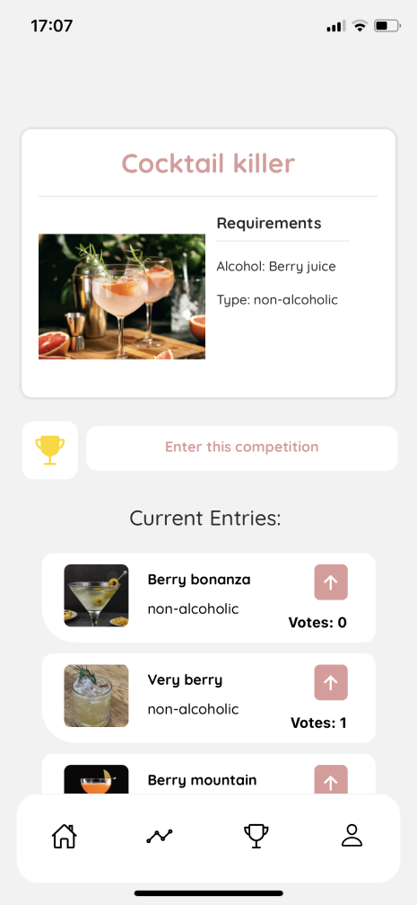
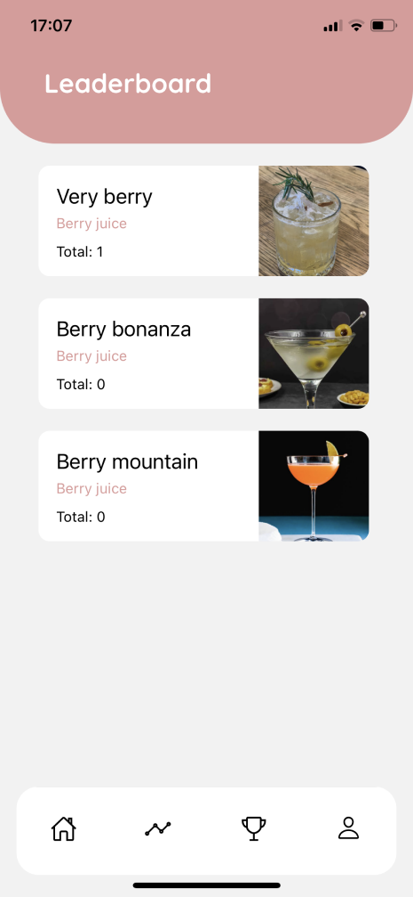
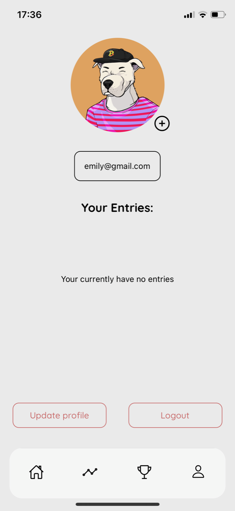
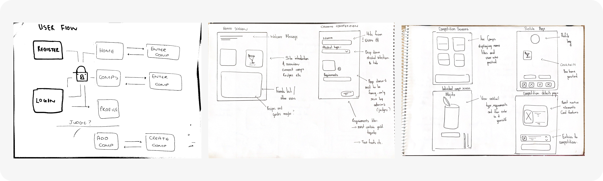
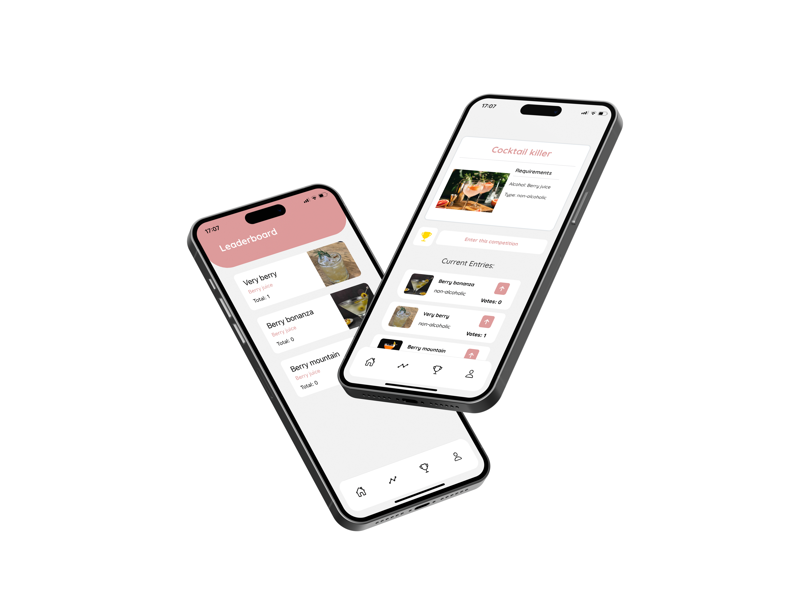

<!-- HEADER SECTION -->
<h3 align="center" style="padding:0;margin:0;font-weight:bold">Liam Wedge</h3>
<h3 align="center" style="padding:0;margin:0;font-weight:bold">21100218</h3>
<h5 align="center" style="font-weight:bold">DV300 - Term 2 Project | 2023</h5>
</br>
<p align="center">

  <a href="https://github.com/NoSleepTillLambos/TheNaughtySailor">
    
  </a>
  
  <h3 align="center">The Naughty Sailor</h3>
  <h5 align="center">A project developed around the bartending & service industry with emphasis on bartending and mixology</h5>
  
<br/>  
<a href="https://drive.google.com/drive/folders/1bHFGq7nIGPdDqJGrCNNCiSqTUyPk-h7F">Demo</a>
<a href="https://github.com/NoSleepTillLambos/TheNaughtySailor">Report Bug</a>

</p>
<!-- TABLE OF CONTENTS -->

## Table of Contents

- [Getting Started](#getting-started)
  - [Prerequisites](#prerequisites)
  - [How to install](#how-to-install)
- [Features and Functionality](#features-and-functionality)
- [Concept Process](#concept-process)
  - [Ideation](#ideation)
  - [WireFrames](#wireframes)
  - [Custom UI](#user-flow)
- [Development Process](#development-process)
  - [Implementation Process](#implementation-process)
  - [Future Implementation](#peer-reviews)
- [Final Outcome](#final-outcome)
  - [Mockups](#mockups)
  - [Video Demonstration](#video-demonstration)
- [Conclusion](#conclusion)
- [License](#license)
- [Contact](liamwedge00@gmail.com)
- [Acknowledgements](#acknowledgements)

<!-- header image of project -->
<p align="center">
  </img>
</p>

### Project Description

**Naughty sailor is based off one of my favourite cocktails from a popular bar i used to work at and where i got the inspiration for my app. It allows users to vote on certain drinks and enter into competitions where they can face off and determine the best mixologist around**

### Built With


**<!-- GETTING STARTED -->**

## Getting Started

The following instructions will get you a copy of the project up and running on your local machine for development and testing purposes.

### Prerequisites

Ensure that you have the latest version of [NPM](https://www.npmjs.com/) installed on your machine. The [GitHub Desktop](https://desktop.github.com/) program will also be required.

### How to install

### Installation

Here are a couple of ways to clone this repo:

1.  GitHub Desktop </br>
    Enter `https://github.com/NoSleepTillLambos/TheNaughtySailor` into the URL field and press the `Clone` button.

2.  Clone Repository </br>
    Run the following in the command-line to clone the project:

    ```sh
    git clone https://github.com/NoSleepTillLambos/TheNaughtySailor
    ```

        Open `Software` and select `File | Open...` from the menu. Select cloned directory and press `Open` button

3.  Install Dependencies </br>
    Run the following in the command-line to install all the required dependencies:

    ```sh
    npm install
    ```

4.  An API key is not required for this installation

<!-- FEATURES AND FUNCTIONALITY-->

**Old Features**



### New features & functionality

**Feature 1**
</br>

</br>
</br>
**🏆 Users can discover newly listed competitions, read the requirements & enter** 

**Feature 2**
</br>

</br>
</br>

**🔎 Check leaderboard standings**

**Feature 3**
</br>

</br>
</br>
<!-- CONCEPT PROCESS -->
## Concept Process

### Road Map and conceptual process
**The concept originated from my job. I work as a bartender at a high end establishment and always felt the need for customers to have the ability to visit the shop,
have a cocktail and then rate it on an app of some sort, thus my idea was born! | I wanted users to learn from people in the industry**
</br>
</br>

<br/>

## Development Process

- I spent a lot of time on apps that were in line with what i was trying to create, i.e restaurants, bars etc and went through the functionality and how the app was going to work
- A lot of the process went towards and was guided around the question of **how can i make this a real world application?** **what do i need to do for this app to be world ready?**
- I also accepted this as a growing project, one i can keep bettering and working on. There are so many options and ideas i want to add to this project in the future

### Implementation Process 

<!-- This is your time to shine, explain the technical nuances of your project, how did you achieve the final outcome!-->

- A big part of the process was getting familiar with Expo and the world of mobile development and getting familiar with working on android and ios.
- The project is very frontend orientated especially as my first app that i am developing i wanted it to be as thought out as possible with every little piece to be tailormade.

#### Above And Beyond

**Going above and beyond the brief**

<!-- what did you learn outside of the classroom and implement into your project-->

- **Lottie animations**
- **Onboarding screens**

### Future Implementation

<!-- stipulate functionality and improvements that can be implemented in the future. -->

- **Search functionality**
- **Comment section where users can visit the individual entries and leave comments on their fellow competitors drinks**
- **Google login and verification**
- **Skeleton loading animations, they add a great touch to the UI and the experience of the app**

<!-- MOCKUPS -->

## Final Outcome

### Mockups


<br>

<br>

<br>

<!-- VIDEO DEMONSTRATION -->

### Video Demonstration

To see a run through of the application, please click below:

See the [open issues](https://github.com/NoSleepTillLambos/TheNaughtySailor) for a list of proposed features (and known issues).

<!-- AUTHORS -->

## Authors

[LiamWedge](https://github.com/NoSleepTillLambos)

<!-- LICENSE -->

## License

Distributed under the MIT License. See `LICENSE` for more information.\

<!-- LICENSE -->

## Contact

**Liam Wedge** - [liamwedge00@gmail.com]()
**Naughty Sailor** - https://github.com/NoSleepTillLambos/TheNaughtySailor

<!-- ACKNOWLEDGEMENTS -->

## Acknowledgements

**_Languages & frameworks_**

<!-- all resources that you used and Acknowledgements here -->


**_UI_**

- [Lottie](https://lottiefiles.com/) (Lottie animation loaders/ onboarding ui)
- [unDraw](https://undraw.co/) (Easy & free to use website for illustrations / easily customizable to fit your apps color pallete)
- [React-Native Elements](https://reactnativeelements.com/) (Onboarding screens/ skeleton loaders as well as further UI implementation)
