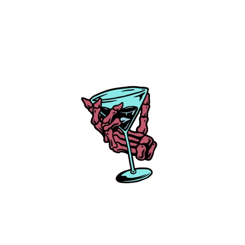

<!-- Repository Information & Links-->
<br />


<!-- HEADER SECTION -->
<h5 align="center" style="padding:0;margin:0;">Liam Wedge</h5>
<h5 align="center" style="padding:0;margin:0;">21100218</h5>
<h6 align="center">DV300 - Term 2 Project | 2023</h6>
</br>
<p align="center">

  <a href="https://github.com/NoSleepTillLambos/BlockBabies">
    
  </a>
  
  <h3 align="center">The Naughty Sailor</h3>

  <p align="center">
    This project was developed using React-native and Firebase and utilizes features <br>
    
    
   <br />
   <br />
   <a href="https://drive.google.com/drive/folders/1bHFGq7nIGPdDqJGrCNNCiSqTUyPk-h7F">View Demo</a>
    ·
    <a href="https://github.com/NoSleepTillLambos/BlockBabies">Report Bug</a>
    ·
    
</p>
<!-- TABLE OF CONTENTS -->

## Table of Contents

- The project is centred around the world of Block babies, a fictional world I have developed based on the game <br/>
  <a href="https://axieinfinity.com/">Axie infinity</a>
- [Getting Started](#getting-started)
  - [Prerequisites](#prerequisites)
  - [How to install](#how-to-install)
- [Features and Functionality](#features-and-functionality)
- [Concept Process](#concept-process)
  - [Ideation](#ideation)
  - [WireFrames](#wireframes)
  - [Custom UI](#user-flow)
- [Development Process](#development-process)
  - [Implementation Process](#implementation-process)
  - [Future Implementation](#peer-reviews)
- [Final Outcome](#final-outcome)
  - [Mockups](#mockups)
  - [Video Demonstration](#video-demonstration)
- [Conclusion](#conclusion)
- [License](#license)
- [Contact](liamwedge00@gmail.com)
- [Acknowledgements](#acknowledgements)

<!-- header image of project -->


### Project Description

Algo crypt is a crypto currency web application designed to provide users with the ability to analyze various price points and historical data about the top 5 currencies by market cap, namely Bitcoin, Ethereum, BNB, USDT etc

### Built With

- [Angular](https://angular.io/)
- [Typescript](https://www.typescriptlang.org/)
- [Angular material](https://material.angular.io/)

<!-- GETTING STARTED -->

## Getting Started

The following instructions will get you a copy of the project up and running on your local machine for development and testing purposes.

### Prerequisites

Ensure that you have the latest version of [NPM](https://www.npmjs.com/) installed on your machine. The [GitHub Desktop](https://desktop.github.com/) program will also be required.

### How to install

### Installation

Here are a couple of ways to clone this repo:

1.  GitHub Desktop </br>
    Enter `https://github.com/NoSleepTillLambos/BlockBabies` into the URL field and press the `Clone` button.

2.  Clone Repository </br>
    Run the following in the command-line to clone the project:

    ```sh
    git clone https://github.com/NoSleepTillLambos/BlockBabies
    ```

        Open `Software` and select `File | Open...` from the menu. Select cloned directory and press `Open` button

3.  Install Dependencies </br>
    Run the following in the command-line to install all the required dependencies:

    ```sh
    npm install
    ```

4.  An API key is not required for this installation

<!-- FEATURES AND FUNCTIONALITY-->
<!-- You can add the links to all of your imagery at the bottom of the file as references -->

## Features and Functionality

<!-- note how you can use your gitHub link. Just make a path to your assets folder -->


### Feature 2

Login functionality that prevents a user from logging into without the correct credentials and accessing the database and data within

### Feature 3

<!-- CONCEPT PROCESS -->
<!-- Briefly explain your concept ideation process -->
<!-- here you will add things like wireframing, data structure planning, anything that shows your process. You need to include images-->

## Concept Process

My main source of inspiration was drawn from Axie infinity, so a lot of my inspiration was designed around them and their website and agenda
Its a game i have quite a lot of experience using and a lot of time within the app so it helped a lot with my designs.

### Road Map and conceptual process


<!-- DEVELOPMENT PROCESS -->

## Development Process

I had to decide what my project was going to be based on and what the general theme would be. <br/> from playing Axie a lot
and with the general idea being the same as what was expected of us in the brief i decided to base it off this.

### Implementation Process

<!-- stipulate all of the functionality you included in the project -->
<!-- This is your time to shine, explain the technical nuances of your project, how did you achieve the final outcome!-->

- A big part of the process was getting familiar with Expo and the world of mobile development and getting familiar with working on android and ios.

#### Above And Beyond

Going above and beyond the brief

<!-- what did you learn outside of the classroom and implement into your project-->

- Search functionality

### Future Implementation

<!-- stipulate functionality and improvements that can be implemented in the future. -->

- In the future i would love to incorporate real world blockchain technology and maintain users funds.

<!-- MOCKUPS -->

## Final Outcome

### Mockups


<br>


<!-- VIDEO DEMONSTRATION -->

### Video Demonstration

To see a run through of the application, please click below:

[View Demonstration](https://drive.google.com/drive/folders/1IiMC4ZpDRhs8Q5RuAk9rlZmzaHfeihNa)

See the [open issues](https://github.com/NoSleepTillLambos/BlockBabies) for a list of proposed features (and known issues).

<!-- AUTHORS -->

## Authors

[LiamWedge](https://github.com/NoSleepTillLambos)

<!-- LICENSE -->

## License

Distributed under the MIT License. See `LICENSE` for more information.\

<!-- LICENSE -->

## Contact

- **Liam Wedge** - [liamwedge00@gmail.com]()
- **Project Link** - https://github.com/NoSleepTillLambos/BlockBabies

<!-- ACKNOWLEDGEMENTS -->

## Acknowledgements

<!-- all resources that you used and Acknowledgements here -->

- [Angular](https://angular.io/)
- [Typescript](https://www.typescriptlang.org/)
- [Angular material](https://material.angular.io/)
